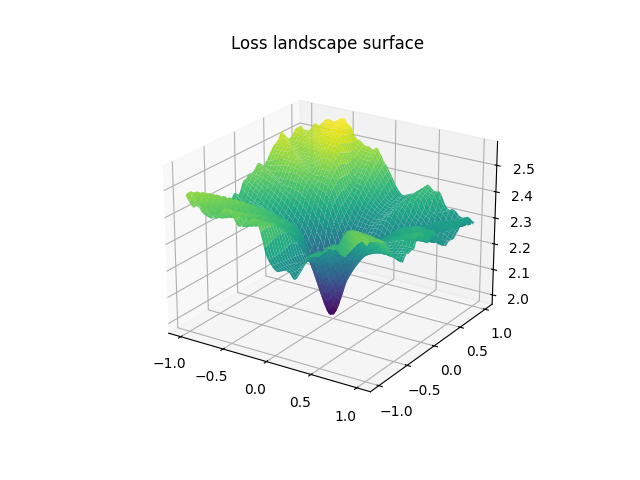
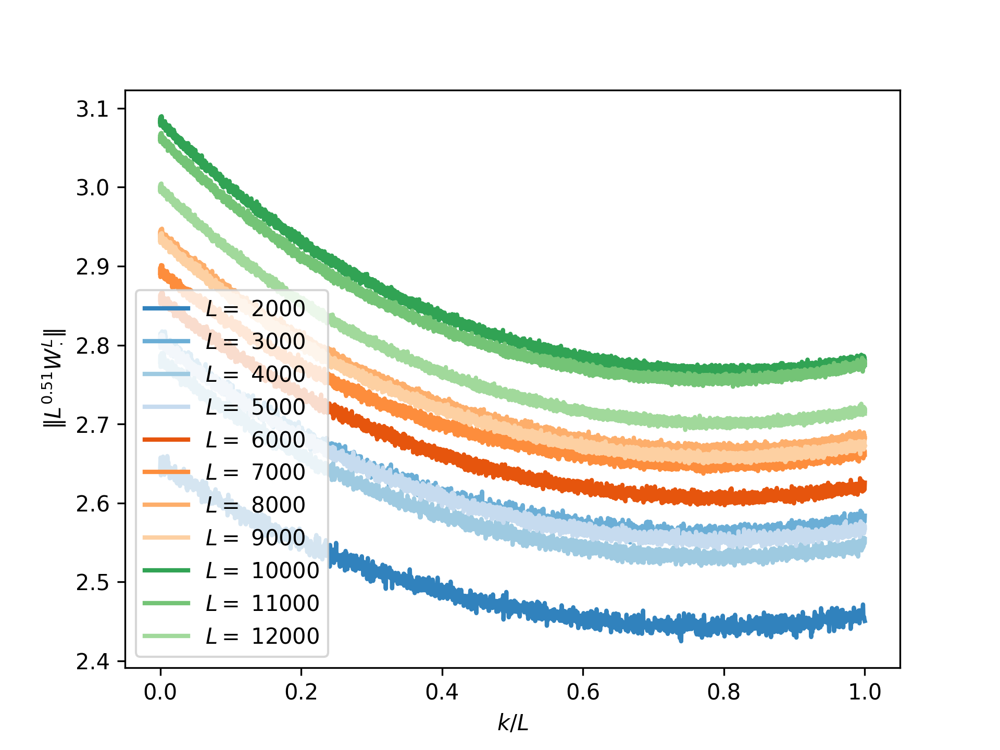
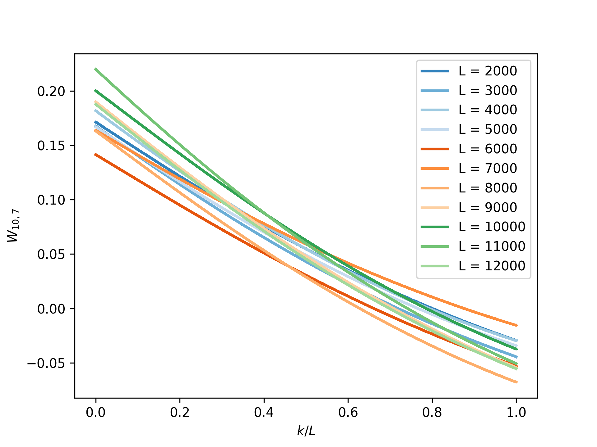
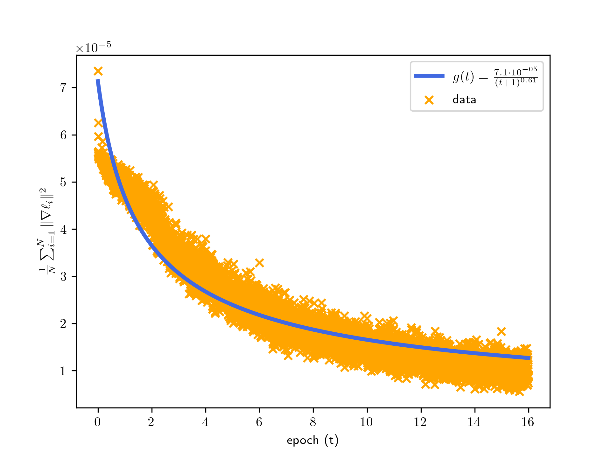

# Weights regularity for Residual Neural Networks in the depth limit

Companion code for the thesis *Weights regularity for residual
neural networks in the depth limit*. 

## Installation 

To install all dependencies use `pipenv install`.
To install the sub-module [p-var](https://github.com/ntapiam/rust-pvar), 
be sure to run `git submodule update --init`, then run `pipenv run
pvar-install`.

## Datasets available 

The dataset modules' code is available in `dataset.py`. Here we list a brief
description of the modules:         
* MNIST: a dataset consisting of 60000 greyscale images with resolution 28x28
  representing digits from $0$ to $9$. See for more information [MNIST
  Wikipedia](https://en.wikipedia.org/wiki/MNIST_database).
* CIFAR10: a dataset consisting of 50000 colored images with resolution 32x32
  representing 10 different class of objects, e.g. cats, dogs, deer, bird,
  frog, etc. For more information see [CIFAR10](https://www.cs.toronto.edu/~kriz/cifar.html).
* SinDataModule: a synthetic dataset given by couples of points $(x, \sin(x))$ with
  $x \in [-1,1]$. The parameter $c$ determines the separability condition of the
  input data, namely 
  $$ | \langle x_i, x_j \rangle| \le \frac{e^{-4c}}{8N}$$
  to be similar to the Assumption (iii) [[1]](#1).
* ConstantDataModule: a synthetic dataset given by couples of points $(x, c)$ with
  uniformly sampled in the range $[-1,1]$ and $c$ being a parameter of the
  dataset with default value $0.1$.

## Models and hyper-parameters

There are two main models available with a plethora of hyper-parameters to
choose. The two models are diversified by their loss function. Namely,       
* `ClassificationModel`: a model that uses as loss function the
  CrossEntropyLoss and it evaluates metrics such as accuracy, precision and
  recall. By adjusting the `input_size` parameter of the model it can be trained
  on both CIFAR10 and MNIST dataset.        
* `RegressionModel`: a model that uses the following loss: $$\ell(y,\hat{y}) =
  p^{-1}\| y - \hat{y}\|_{p}^p$$ with $p$ being a parameter of the model. Note
  that it works only for 1-dimensional data as it was used only for very simple
  datasets (namely SinDataModule and ConstantDataModule).        

We give a brief description of the hyper-parameters for the models:      
* `L` : number of layers.
* `alpha`: parameter $\alpha \in [0,1]$ describing the rate of the regularizing
  parameter $\delta_L = L^\alpha$ with $L$ being the number of layers of the
  network. The parameter $\beta = 1-\alpha$ for initialization purposes.
* `gamma`: parameter describing the scale of the initialization.
* `dim`: dimension of the hidden state of the neural network. 
* `input_size`: input dimension used to compute the embedding of the weights
  $U_\text{in}$ only for ClassificationModel. 
* `classes`: if the model is an instance of ClassificationModel, represents the
  size of the output.
* `lr`: learning rate.
* `init`: string value 
    * `constant`: initialize every weight of a layer as $$\frac{1}{d^2}
      L^{-\beta-1/\gamma}$$
    * `ntrunc`: initialize each layer of the model via a truncated normal
      initialization with mean $0$ and std $$\frac{1}{d^2}
      L^{-\beta-1/\gamma}$$ truncated in the range $[-\frac{1}{d^2}
      L^{-\beta-1/\gamma}, \frac{1}{d^2} L^{-\beta-1/\gamma}]$.
* `activation`: string that associates to an activation function. Available
  values are `tanh`, `elu`, `relu`, `gelu`, `sigmoid` which uses the respective
  implementation in PyTorch.
* `augmentation`: string value, available values are `none`, `skip`, `inc_skip`
  and `linear_skip`:
    * `none`: no skip connection, the ResNet is a plain feed-forward neural
      network.
    * `skip`: skip connection of length $1$.
    * `inc_skip`: implements a skip connection with the weights outside the
      activation $$h_{t+1} = h_t + \sigma(h_t) (W_{t+1} - W_t).$$
    * `linear_skip`: implements a skip connection with the weights outside the
      activation function $$h_{t+1} = h_t + \sigma(h_t) W_t.$$
* `dynamic_lr`: boolean value, if true computes the learning rate using at each
  step 
  $$\eta(s+1) = \frac{C\eta(s)}{\| W^{(L)}\|^2_{p-\text{var}}}$$  
  for a constant $C$ dependent on the activation function and a specified
  $p$-variation with $p$ equals to the value of the parameter `p_var`. The idea
  being that if the trajectory becomes less and less regular, we should stop the
  learning procedure as it is an inefficient optimization path.
* `store_grad`: boolean value, if true computes and logs at each gradient
  descent step the value
  $$\Omega(t) = \frac{1}{N} \sum_{i=1}^N \| \nabla_{\hat{y}} \ell(y_i, \hat{y}_i)\|^2$$
  with $\ell$ being the loss function designated for the training procedure.
* `p_var`: float value ranging between $p \in [2, \infty)$. It has logging
  purposes: at each gradient descent step it logs the $p$, $p/2$ and
  $3p/4$-variation of the weights.

## Training 

The training procedure is initialized using the `fit` command. Examples are
clearly needed given the multitude of parameters to choose. Note that after the
training procedure finish, a folder `exported_models/` is created. In this folder,
all trained models are stored as a collection of exported weights, i.e. as a
list of PyTorch tensor, `resnet_L.pth` with `L` being the number of layers of
the trained model.

### Examples

Training with respect to the classification task on CIFAR10 dataset using $2000$
layers of dimension $15$.
```{bash}
pipenv run fit --model=ClassificationModel --data=CIFAR10DataModule --model.L=100 --model.dim=15 --model.input_size=3072 --model.lr=9.0 --model.p_var=2 --model.alpha=0.75 --model.gamma=1.0 --model.init=ntrunc --trainer.max_epochs=39 --data.num_workers=12 --data.training_data_percentage=0.25 --seed_everything=1234 --trainer.default_root_dir=/path/to/model-2000 
```

Training with respect to the regression task on the Constant dataset.
```{bash}
pipenv run fit --model=RegressionModel --data=ConstantDataModule --model.L=128 --model.gamma=1.0 --trainer.max_epochs=25 --data.num_workers=12  --model.lr=9.0 --model.p_var=2.0 --model.init=constant --model.dim=1 --model.alpha=0.75 --model.p_loss=2.0 --data.num_samples=10_000 --data.batch_size=10_000 --seed_everything=1234 --trainer.default_root_dir=/path/to/model-128
```

### resnet_cifa10.py

To train and run the testing for the ResNet model for CIFAR10 from[[2]](#2), 
run
```{bash}
pipenv run python resnet_cifar10.py --L=L
```
with $L = 56, 104, 224$. The logs will be stored in a folder `resnet_events`.
The training is via batch gradient descent with batch size $128$ and for a total
of $16$ epochs.

## Loss landscape visualization



To render a surface with $100$ steps from a model:
```{bash}
pipenv run ll-render --config_path=/path/to/config.yml
--checkpoint_path=/path/to/checkpoint.ckpt --device=gpu --out=export_path
```
The result will be a file storing the result in a `numpy` ndarray in `export_path.npy`.

To visualize a surface run:
```{bash}
pipenv run ll-vis /path/to/surface.npy  
```

## Paths visualization



Displays the norm of the weights as trajectories
```{bash}
pipenv run path-norm --dir_path path/to/a/collection/of/exported_weights --beta=0.75
--pvar=1.0
```

* `dir_path` gives the location of the folder containing one or more weights of
  trained models.
* `ext` string identifying the extension of the file names containing the
  weights of a trained model.
* `pvar` float if it equals $p$, then computes the $p$-variation of the given
  models.
* `pvar_only` only compute the $p$-variation without plotting the norm of the
  trajectories.
* `beta` corresponds to the rescaling $L^\beta$ applied to the trajectories
  before plotting.



To generate images of a singular coordinate of the weights as paths in the
layers, use       
```{bash}
pipenv run path-weights --dir_path path/to/a/collection/of/exported_weights --ext pth --beta=0.5 
```
       
* `dir_path` gives the location of the folder containing one or more weights of
  a trained models.
* `ext` is a string identifying the extension of the file name containing the
  weights of a trained model.
* `beta` corresponds to the rescaling $L^\beta$ applied to the trajectories
  before plotting.         

       
Note: the chosen weights are *hard-coded* for simplicity, to change the weights
to visualize, change the parameters `pos_x`, `pos_y`. 

## Curve fitting procedure for $\Omega(t)$



The curve fitting procedure is implemented via the command `curve-fit`, e.g.
running
```{bash}
pipenv run curve-fit --event_paths /path/to/tensorboard-event --window_size=27
--filter_period=0 --scaling_x=1
```

Description of the parameters:
* `window_size`: an integer value. Before the fitting procedure occurs, it removes the minimum and maximum values every `window_size` elements.
* `filter_period`: an integer value. Before the fitting procedure occurs, it removes every `filter_period` element. For example, if `filter_period` equals $2$, the data is halved and one in two elements is removed. 
* `scaling_x`: a float value. Before the fitting procedure occurs, the `x` axis
  is scaled by the `scaling_x` value. If `scaling_x` is not specified, each
  point has a positive integer value on the x-axis.
* `infer_shift`: boolean value. If true, the fitting procedure uses a function
  $$g(t) = C/(t+T_0)^\rho$$ with $C, T_0, \rho$ as the parameters to infer.
  If false, only $C, \rho$ are computed.

## Bibliography

<a id="#1">[1]</a> Rama Cont, Alain Rossier, and RenYuan Xu. *"Convergence and
Implicit Regularization Properties of Gradient Descent for Deep Residual
Networks."* 2023.        

<a id="#2">[2]</a> Kaiming He, Xiangyu Zhang, Shaoqing Ren, and Jian Sun. *"Deep Residual Learning for Image Recognition"*. In: *2016 IEEE Conference on Computer Vision and Pattern Recognition (CVPR)*. 2016, pp. 770-778.
